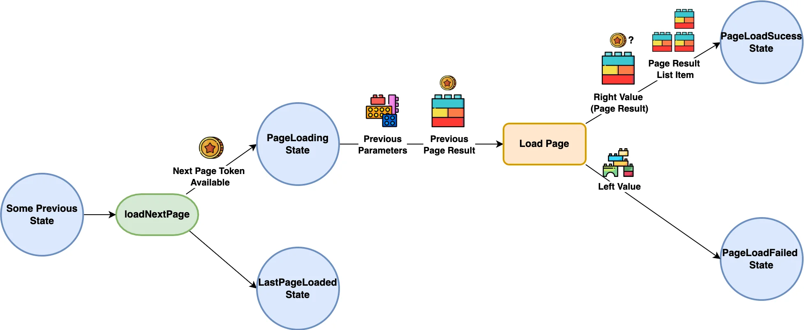

[](https://pub.dev/packages/very_good_analysis)


Apply Clean Architecture with a suite of abstract use cases based on Bloc Cubits.

> This is an extension of the [bloc](https://github.com/felangel/bloc/tree/master/packages/bloc) package.

> This uses the [dartz](https://github.com/spebbe/dartz) package and extensively makes use of its `Either` monad for managing union types.

Inspired by Reso Coder's [Flutter TDD Clean Architecture](https://resocoder.com/flutter-clean-architecture-tdd/).

**Documentation in progress**

## Features

Use this package in your app to:
- Easily create app use cases by abstracting from available [bloc](https://github.com/felangel/bloc/tree/master/packages/bloc) templates for binary execution (runner), pagination and data streaming.
- Receive either left (failed) or right (success) values from your use cases with the help of the [dartz](https://github.com/spebbe/dartz) package.
- Standardize the way you use Blocs.

## Usage

This section contains detailed information for the following topics:

- [The Runner Use Case](#the-runner-use-case)
  - [Creating a Runner](#creating-a-runner)
  - [Using a Runner](#using-a-runner)
- [The Paginator Use Case](#the-paginator-use-case)
  - [Creating a Paginator](#creating-a-paginator)
  - [Creating a Custom Page Result](#creating-a-custom-page-result)
  - [Using a Paginator](#using-a-paginator)

### The Runner Use Case

A simple use case that executes a specific action with the given parameter arguments by calling `Runner.run()` which either returns a `Left` (failed) or `Right` (success) response.


### Creating a Runner

```dart
/// A runner that counts the quantity of each given fruit.
class CountFruit extends Runner<CountFruitParams, Failure, CountFruitResult> {

  /// The callback executed when [run] gets called
  @override
  Future<Either<Failure, CountFruitResult>> onCall(
    CountFruitParams params,
  ) async {
    if (params.fruits.isEmpty) {
      // When the given fruits is empty, then a `Left` value is returned
      return const Left(Failure('There are no fruits to count'));
    }

    final fruitCount = <String, int>{};

    for (final fruit in params.fruits) {
      fruitCount[fruit] = (fruitCount[fruit] ?? 0) + 1;
    }

    // Returns a `Right` value containing the fruit count
    final result = CountFruitResult(fruitCount);
    return Right(result);
  }
}

/// A special parameter for [CountFruit] containing all the available fruits to count.
class CountFruitParams {
  const CountFruitParams(this.fruits);

  final List<String> fruits;
}

/// The `Left` value for [CountFruit].
class Failure {
  const Failure(this.message);

  final String message;

  @override
  String toString() => 'Failure: $message';
}

/// The `Right` value for [CountFruit] containing the count for each fruit.
class CountFruitResult {
  const CountFruitResult(this.fruitCount);

  final Map<String, int> fruitCount;

  @override
  String toString() => '$fruitCount';
}
```

### Using a Runner

```dart
void main() {
  // Initialize a `CountFruit` runner instance
  final countFruit = CountFruit();

  // Execute the runner
  await countFruit.run(
    params: const CountFruitParams(['Apple', 'Orange', 'Apple']),
  );

  // The last `Left` value returned when calling `run()`
  print(countFruit.leftValue);

  // The last `Right` value returned when calling `run()`
  print(countFruit.rightValue);

  // The recent value returned when calling `run()`. This may either be a 
  // `Left` object containing the `leftValue` or a `Right` object containing 
  // the `rightValue`
  print(countFruit.value);

  // To set all these values back to `null`, call `reset()`
}
```

## The Paginator Use Case

A use case for fetching a list of items in a paginated manner. 

A paginator has two available methods for loading pages.

To start paginating, `Paginator.loadFirstPage()` must initially be called. This accepts some given parameter arguments for loading the first page. If the loading fails, then a `Left` value is returned. Otherwise, if the loading succeeds, a `Right` value instance of `PageResult` and a `PageResultListItem` will be returned.


The `PageResult` contains all the items available in the fetched page as well as a `token` for loading the next one, whereas a `PageResultListItem` is a collection of all page results and their aggregated items.

To load the next page, call `Paginator.loadNextPage()`. This uses the old given parameter arguments and page result to load the upcoming page. If the last page has been loaded (i.e. the last page result's token is `null`), then calling this method does nothing.

Calling `loadNextPage()` without initially loading the first page will throw a `StateError`.

> Use the `Paginator.currentPageIndex` to determine if the first page has been loaded. If it is equal to `-1`, then the first page has not been loaded yet.



### Creating a Paginator

```dart
/// A paginator that accepts a list of fruits then returns them in a paginated 
/// manner.
class PaginateFruits extends Paginator<PaginateFruitParams, Failure,
    PageResult<Fruit>, Fruit> {

  /// The callback executed when [loadFirstPage] or [loadNextPage] gets called
  @override
  Future<Either<Failure, PageResult<Fruit>>> onCall(
    PaginateFruitsParams params, [
    PageResult<Fruit>? previousPageResult,
  ]) async {
    if (params.itemsPerPage < 1) {
      // When the items per page is less than 1, then a `Left` value is returned
      return const Left(Failure('Page item count must be greater than 0'));
    }

    final fruits = params.fruits;
    final itemsPerPage = params.itemsPerPage;
    final dynamic nextPageToken = previousPageResult?.nextPageToken;

    final nextFruitStartIndex =
        nextPageToken == null ? 0 : fruits.indexOf(nextPageToken as String) + 1;

    final newFruits =
        fruits.skip(nextFruitStartIndex).take(itemsPerPage).map(Fruit.new);
    
    final newPageToken = newFruits.isNotEmpty ? newFruits.last : null;

    // Return a `Right` value containing the next page of fruits
    return Right(PageResult(newFruits, newPageToken));
  }
}

/// A special parameter for [PaginateFruits] containing all the available
/// fruits to paginate and the number of fruits per page.
class PaginateFruitsParams {
  const PaginateFruitsParams({required this.fruits, required this.itemsPerPage});

  final List<String> fruits;
  final int itemsPerPage;
}

/// The `Left` value for [PaginateFruit].
class Failure {
  const Failure(this.message);

  final String message;

  @override
  String toString() => 'Failure: $message';
}

/// A data model returned by the `Right` [PageResult] of [PaginateFruit].
class Fruit {
  const Fruit(this.fruit);

  final String fruit;

  @override
  String toString() => fruit;
}
```

### Creating a Custom Page Result

If you want to have additional properties and behaviors in the `PageResult`, then consider extending it.

> Since `PageResult` uses the `EquatableMixin` from the [equatable](https://pub.dev/packages/equatable) package, don't forget to add your custom properties in `props`.

```dart
class PaginateFruitsResult extends PageResult<Fruit> {
  PaginateFruitsResult(this.remainingPages, Iterable<Fruit> items, dynamic nextPageToken)
      : super(items, nextPageToken);

  /// A custom property
  final int remainingPages;

  /// Add custom properties in props.
  @override
  List<Object?> get props => super.props..addAll([remainingPages]);

  @override
  String toString() => items.toString();
}
```


### Using a Paginator

```dart
// Initialize a `PaginateFruits` paginator instance
final paginateFruits = PaginateFruits();

// Load the first page
await paginateFruits.loadFirstPage(
    params: const PaginateFruitsParams(
      fruits: ['Apple', 'Orange', 'Kiwi', 'Lime'],
      itemsPerPage: 2,
    ),
  );

// Load the next page
await paginateFruits.loadNextPage();

// The last `Left` value returned when calling `loadFirstPage()` or
// `loadNextPage()`
print(paginateFruits.leftValue);

// The last `Right` value instance of `PageResult` returned when calling
// `loadFirstPage()` or `loadNextPage()`
print(paginateFruits.rightValue);

// The recent value returned when calling `loadFirstPage()` or
// `loadNextPage()`. This may either be a `Left` object containing the
// `leftValue` or a `Right` object containing the `rightValue`
print(paginateFruits.value);

/// Contains all the page results and an aggregate of all their items
print(paginateFruits.pageResultItemList);

// The index of the last page loaded
print(paginateFruits.currentPageIndex);

// To set all these values back to `null`, call `reset()`
```