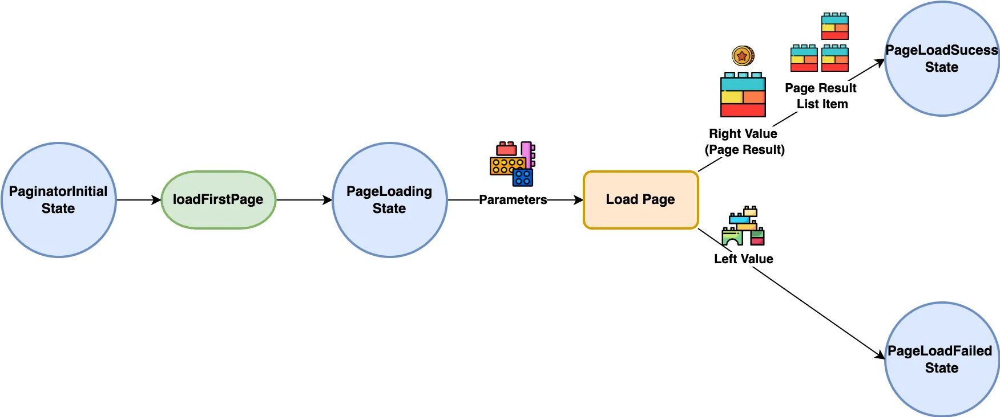
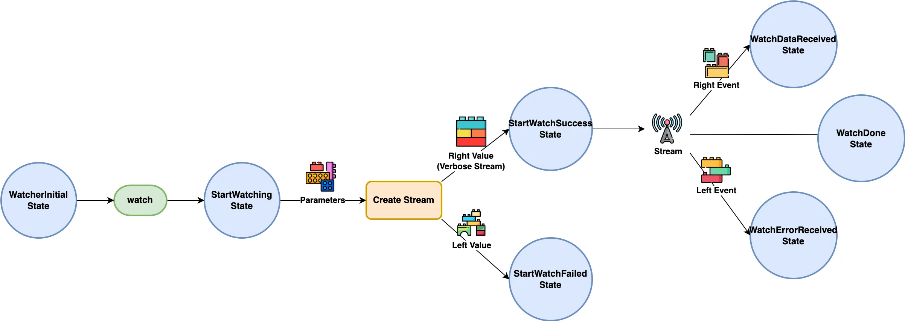

[](https://pub.dev/packages/very_good_analysis)


 
Apply Clean Architecture with a suite of abstract use cases based on Bloc Cubits.
 
> This is an extension of the [bloc](https://github.com/felangel/bloc/tree/master/packages/bloc) package.
 
> This uses the [dartz](https://github.com/spebbe/dartz) package and extensively makes use of its `Either` monad for managing union types.
 
Inspired by Reso Coder's [Flutter TDD Clean Architecture](https://resocoder.com/flutter-clean-architecture-tdd/).
 
 
## Features
 
Use this package in your app to:
- Easily create app use cases by abstracting from available [bloc](https://github.com/felangel/bloc/tree/master/packages/bloc) templates for binary execution (runner), pagination and data streaming.
- Receive either left (failed) or right (success) values from your use cases with the help of the [dartz](https://github.com/spebbe/dartz) package.
- Standardize the way you use Blocs.
 
## Usage
 
This section contains detailed information for the following topics:
 
- [The Runner Use Case](#the-runner-use-case)
 - [Creating a Runner](#creating-a-runner)
 - [Using a Runner](#using-a-runner)
- [The Paginator Use Case](#the-paginator-use-case)
 - [Creating a Paginator](#creating-a-paginator)
 - [Using a Paginator](#using-a-paginator)
 - [Creating a Custom Page Result](#creating-a-custom-page-result)
- [The Watcher Use Case](#the-watcher-use-case)
 - [Creating a Watcher](#creating-a-watcher)
 - [Using a Watcher](#using-a-watcher)
 - [Creating a Custom Verbose Stream](#creating-a-custom-verbose-stream)
- [The Batch Runner Use Case](#the-batch-runner-use-case)
 - [Creating a Batch Runner](#creating-a-batch-runner)
 - [Using a Batch Runner](#using-a-batch-runner)
 - [Creating a Custom Use Case Factory](#creating-a-custom-use-case-factory)
- [Resetting a Use Case](#resetting-a-use-case)
 
### The Runner Use Case
 
A simple use case that executes a specific action with the given parameter arguments by calling `Runner.run()` which either returns a `Left` (failed) or `Right` (success) response.
 

 
### Creating a Runner
 
For more info, see the [Runner](https://github.com/CodenicCoders/codenic_bloc_use_case/blob/master/lib/src/runner/runner.dart) docs.
 
```dart
/// A runner that counts the quantity of each given fruit.
class CountFruit extends Runner<CountFruitParams, Failure, CountFruitResult> {
 
 /// The callback executed when [run] gets called
 @override
 Future<Either<Failure, CountFruitResult>> onCall(
   CountFruitParams params,
 ) async {
   if (params.fruits.isEmpty) {
     // When the given fruits is empty, then a `Left` value is returned
     return const Left(Failure('There are no fruits to count'));
   }
 
   final fruitCount = <String, int>{};
 
   for (final fruit in params.fruits) {
     fruitCount[fruit] = (fruitCount[fruit] ?? 0) + 1;
   }
 
   // Returns a `Right` value containing the fruit count
   final result = CountFruitResult(fruitCount);
   return Right(result);
 }
}
 
/// A special parameter for [CountFruit] containing all the available fruits to
/// count.
class CountFruitParams {
 const CountFruitParams(this.fruits);
 
 final List<String> fruits;
}
 
/// The `Left` value for [CountFruit].
class Failure {
 const Failure(this.message);
 
 final String message;
 
 @override
 String toString() => 'Failure: $message';
}
 
/// The `Right` value for [CountFruit] which contains the count for each fruit.
class CountFruitResult {
 const CountFruitResult(this.fruitCount);
 
 final Map<String, int> fruitCount;
 
 @override
 String toString() => '$fruitCount';
}
```
 
### Using a Runner
 
```dart
void main() {
 // Initialize a `CountFruit` runner instance
 final countFruit = CountFruit();
 
 // Execute the runner
 await countFruit.run(
   params: const CountFruitParams(['Apple', 'Orange', 'Apple']),
 );
 
 // The last `Left` value returned when calling `run()`
 print(countFruit.leftValue);
 
 // The last `Right` value returned when calling `run()`
 print(countFruit.rightValue);
 
 // The recent value returned when calling `run()`. This may either be a
 // `Left` object containing the `leftValue` or a `Right` object containing
 // the `rightValue`
 print(countFruit.value);
 
 // To set all these values back to `null`, call `reset()`
}
```
 
## The Paginator Use Case
 
A use case for fetching a list of items in a paginated manner.
 
A paginator has two available methods for loading pages.
 
To start paginating, `Paginator.loadFirstPage()` must initially be called. This accepts some given parameter arguments for loading the first page. If the loading fails, then a `Left` value is returned. Otherwise, if the loading succeeds, a `Right` value instance of `PageResult` and a `PageResultListItem` will be returned.
 

 
The `PageResult` contains all the items available in the fetched page as well as a `token` for loading the next one, whereas a `PageResultListItem` is a collection of all page results and their aggregated items.
 
To load the next page, call `Paginator.loadNextPage()`. This uses the old given parameter arguments and page result to load the upcoming page. If the last page has been loaded (i.e. the last page result's token is `null`), then calling this method does nothing.
 
Calling `loadNextPage()` without initially loading the first page will throw a `StateError`.
 
> Use the `Paginator.currentPageIndex` to determine if the first page has been loaded. If it is equal to `-1`, then the first page has not been loaded yet.
 

 
### Creating a Paginator
 
For more info, see the [Paginator](https://github.com/CodenicCoders/codenic_bloc_use_case/blob/master/lib/src/paginator/paginator.dart) docs.
 
```dart
/// A paginator that accepts a list of fruits then returns them in a paginated
/// manner.
class PaginateFruits extends Paginator<PaginateFruitsParams, Failure,
   PageResult<String>, String> {
 
 /// The callback executed when [loadFirstPage] or [loadNextPage] gets called.
 /// Page loading occurs here.
 @override
 Future<Either<Failure, PageResult<String>>> onCall(
   PaginateFruitsParams params, [
   PageResult<String>? previousPageResult,
 ]) async {
   if (params.itemsPerPage < 1) {
     // When the items per page is less than 1, then a `Left` value is returned
     return const Left(Failure('Page item count must be greater than 0'));
   }
 
   final fruits = params.fruits;
   final itemsPerPage = params.itemsPerPage;
   final dynamic nextPageToken = previousPageResult?.nextPageToken;
 
   final nextFruitStartIndex =
       nextPageToken == null ? 0 : fruits.indexOf(nextPageToken as String) + 1;
 
   final newFruits =
       fruits.skip(nextFruitStartIndex).take(itemsPerPage);
  
   final newPageToken = newFruits.isNotEmpty ? newFruits.last : null;
 
   // Return a `Right` value containing the next page of fruits
   return Right(PageResult(newFruits, newPageToken));
 }
}
 
/// A special parameter for [PaginateFruits] containing all the available
/// fruits to paginate and the number of fruits per page.
class PaginateFruitsParams {
 const PaginateFruitsParams({required this.fruits, required this.itemsPerPage});
 
 final List<String> fruits;
 final int itemsPerPage;
}
 
/// The `Left` value for [PaginateFruits].
class Failure {
 const Failure(this.message);
 
 final String message;
 
 @override
 String toString() => 'Failure: $message';
}
```
 
### Using a Paginator
 
```dart
// Initialize a `PaginateFruits` paginator instance
final paginateFruits = PaginateFruits();
 
// Load the first page
await paginateFruits.loadFirstPage(
   params: const PaginateFruitsParams(
     fruits: ['Apple', 'Orange', 'Kiwi', 'Lime'],
     itemsPerPage: 2,
   ),
 );
 
// Load the next page
await paginateFruits.loadNextPage();
 
// The last `Left` value returned when calling `loadFirstPage()` or
// `loadNextPage()`
print(paginateFruits.leftValue);
 
// The last `Right` value instance of `PageResult` returned when calling
// `loadFirstPage()` or `loadNextPage()`
print(paginateFruits.rightValue);
 
// The recent value returned when calling `loadFirstPage()` or
// `loadNextPage()`. This may either be a `Left` object containing the
// `leftValue` or a `Right` object containing the `rightValue`
print(paginateFruits.value);
 
/// Contains all the page results and an aggregate of all their items
print(paginateFruits.pageResultItemList);
 
// The index of the last page loaded
print(paginateFruits.currentPageIndex);
 
// To set all these values back to `null`, call `reset()`
```
 
### Creating a Custom Page Result
 
If you want to have additional properties and behaviors in the `PageResult`, then consider extending it.
 
> Since `PageResult` uses the `EquatableMixin` from the [equatable](https://pub.dev/packages/equatable) package, don't forget to add your custom properties in `props`.
 
```dart
class PaginateFruitsResult extends PageResult<Fruit> {
 PaginateFruitsResult(this.remainingPages, Iterable<Fruit> items, dynamic nextPageToken)
     : super(items, nextPageToken);
 
 /// A custom property
 final int remainingPages;
 
 /// Add custom properties in props.
 @override
 List<Object?> get props => super.props..addAll([remainingPages]);
 
 @override
 String toString() => items.toString();
}
```
 
## The Watcher Use Case
A use case for watching a stream that emits a `Left` (error) or `Right` (data) event.
 
Call the `Watcher.watch()` to start creating and listening to a stream. This returns a `Left` value when the stream initialization fails. When the stream setup succeeds, a `Right` value instance of `VerboseStream` will be provided.
 
A `VerboseStream` contains the stream being listened to and an error converter which converts the error received by the stream to the specified `Left` error event.
 

 
### Creating a Watcher
 
For more info, see the [Watcher](https://github.com/CodenicCoders/codenic_bloc_use_case/blob/master/lib/src/watcher/watcher.dart) docs.
 
```dart
/// A watcher for streaming fruits that goes inside the fruit basket.
class WatchFruitBasket extends Watcher<WatchFruitBasketParams, Failure,
   VerboseStream<Failure, FruitBasket>, Failure, FruitBasket> {
 StreamController<FruitBasket>? streamController;
 
 int? basketCapacity;
 List<String>? fruits;
 
 /// The callback triggered when [watch] is called. Use this to create a
 /// [VerboseStream] containing the target stream.
 @override
 Future<Either<Failure, VerboseStream<Failure, FruitBasket>>> onCall(
   WatchFruitBasketParams params,
 ) async {
   if (params.maxCapacity < 1) {
     // When the basket capacity is less than 1, then a left value is returned
     return const Left(Failure('Basket capacity must be greater than 0'));
   }
 
   basketCapacity = params.maxCapacity;
   fruits = [];
   await streamController?.close();
 
   streamController = StreamController<FruitBasket>();
 
   // Return a right value `VerboseStream` containing the stream that will be
   // listened to and its error converter
   return Right(
     VerboseStream(
       stream: streamController!.stream,
       errorConverter: (error, stackTrace) => Failure(error.toString()),
     ),
   );
 }
 
 
 void addFruits(List<String> newFruits) {
   if (fruits == null || basketCapacity == null || streamController == null) {
     return;
   }
 
   if (fruits!.length + newFruits.length <= basketCapacity!) {
     fruits!.addAll(newFruits);
     // Emit a right data event.
     streamController!.add(FruitBasket(fruits!));
   } else {
     // Emit a left data event.
     streamController!.addError(Exception('Fruit Basket is full'));
   }
 }
 
 Future<void> closeStream() async => streamController?.close();
 
 @override
 Future<void> close() {
   streamController?.close();
   return super.close();
 }
}
 
/// A special parameter for [WatchFruitBasket] for setting its max capacity.
class WatchFruitBasketParams {
 const WatchFruitBasketParams({required this.maxCapacity});
 
 final int maxCapacity;
}
 
/// The `Left` value for [WatchFruitBasket].
class Failure {
 const Failure(this.message);
 
 final String message;
 
 @override
 String toString() => 'Failure: $message';
}
 
/// The `Right` value for [WatchFruitBasket].
class FruitBasket {
 const FruitBasket(this.fruits);
 
 final List<String> fruits;
 
 @override
 String toString() => 'FruitBasket: $fruits';
}
```
 
### Using a Watcher
 
```dart
Future<void> watcher() async {
 
 // Initialize a `WatchFruitBasket` watcher instance
 final watchFruitBasket = WatchFruitBasket();
 
 // Start the stream
 await watchFruitBasket.watch(
   params: const WatchFruitBasketParams(maxCapacity: 4),
 );
 
 // Add fruits to emit a right event
 watchFruitBasket.addFruits(['Apple', 'Orange', 'Mango']);
 
 await Future<void>.delayed(Duration.zero);
 
 // The last left value returned when calling `watch()`
 print(watcher.leftValue);
 
 // The last right value instance of `VerboseStream` returned when calling
 // `watch()`
 print(watcher.rightValue);
 
 // The recent value returned when calling `watch()`. This may either be a
 // `Left` object containing the `leftValue` or a `Right` object containing
 // the `rightValue`
 print(watcher.value);
 
 // The last error event emitted by the stream created by calling
 // `watch()`
 print(watcher.leftEvent);
 
 // The last data event emitted by the stream created by calling
 // `watch()`
 print(watcher.rightEvent);
 
 // The recent value returned by the watch-created stream. This can either
 // reference the `leftEvent` or the `rightEvent`
 print(watcher.event);
 
 // To set all these values back to `null`, call `reset()`
}
```
 
### Creating a Custom Verbose Stream
 
A custom `VerboseStream` can be created if you want to add new properties or
customize its behavior.
 
```dart
class CustomVerboseStream extends VerboseStream<Failure, List<String>> {
 CustomVerboseStream({
   required this.streamController,
   required Stream<List<String>> stream,
   required Failure Function(Object, StackTrace?) errorConverter,
 }) : super(
         stream: stream,
         errorConverter: errorConverter,
       );
 
 /// A custom property
 final StreamController streamController;
 
 @override
 StreamSubscription<List<String>> listen(
   void Function(List<String>) onData, {
   void Function(Failure)? onError,
   void Function()? onDone,
   bool? cancelOnError,
 }) {
   // Custom stream behavior
   return stream.listen((event) {
   });
 }
}
```
 
## The Batch Runner Use Case
 
The batch runner allows you to run multiple use cases at the same time or by batch.
 
First, a `BatchRunner` must be given a list of `UseCaseFactory` responsible for
creating and calling a specific `UseCase`, and a constructor parameter fed to the use case factories for constructing the use cases.
 
To start the batch run, call `BatchRunner.batchRun`. All use case factories on
the first batch will be triggered with the given parameter arguments. If all of them are successful, then the next
batch will push through followed by the next. If any of the use case fails,
then the batch run will halt.
 
Call the `BatchRunner.batchRun` again to continue the batch run. By default,
all previous successfully executed use cases will not be triggered. This behavior can be
altered by creating a custom `UseCaseFactory`.
 
Every batch run call, regardless whether it succeeds or fails, returns a
`BatchRunResult` containing all the failed `leftUseCases` and successful
`rightUseCases`.
 
> A `Runner`, `Paginator`, and `Watcher` can be placed in a `BatchRunner`.
 

 
### Creating A Batch Runner
 
For more info, see the [BatchRunner](https://github.com/CodenicCoders/codenic_bloc_use_case/blob/master/lib/src/batch_runner/batch_runner.dart) docs.
 
```dart
/// Fetches a meal by creating and executing the [FetchFruits] and
/// [FetchVeggies] use cases in the first batch, followed by [FetchGrains] in
/// the second batch.
class BatchFetchMeal extends BatchRunner<Failure, dynamic,
   BatchFetchMealConstructorParams, BatchFetchMealCallParams> {
 BatchFetchMeal({
   required BatchFetchMealConstructorParams constructorParams,
 }) : super(
         useCaseConstructorParams: constructorParams,
         useCaseFactories: [
           // The first batch of use cases
           [
             UseCaseFactory<Failure, dynamic, BatchFetchMealConstructorParams,
                 BatchFetchMealCallParams, FetchFruits>(
               useCaseFactory: (constructorParams) =>
                   FetchFruits(fruits: constructorParams.availableFruits),
               onCall: (callParams, useCase) =>
                   useCase.call(callParams.fruitCount),
             ),
             UseCaseFactory<Failure, dynamic, BatchFetchMealConstructorParams,
                 BatchFetchMealCallParams, FetchVeggies>(
               useCaseFactory: (constructorParams) =>
                   FetchVeggies(veggies: constructorParams.availableVeggies),
               onCall: (callParams, useCase) =>
                   useCase.call(callParams.veggieCount),
             )
           ],
           // The second batch of use cases
           [
             UseCaseFactory<Failure, dynamic, BatchFetchMealConstructorParams,
                 BatchFetchMealCallParams, FetchGrains>(
               useCaseFactory: (constructorParams) =>
                   FetchGrains(grains: constructorParams.availableGrains),
               onCall: (callParams, useCase) =>
                   useCase.call(callParams.grainCount),
             )
           ]
         ],
       );
}
 
/// The parameter passed to each [UseCaseFactory] to initialize a use case.
class BatchFetchMealConstructorParams {
 const BatchFetchMealConstructorParams({
   required this.availableFruits,
   required this.availableVeggies,
   required this.availableGrains,
 });
 
 final List<String> availableFruits;
 final List<String> availableVeggies;
 final List<String> availableGrains;
}
 
/// The parameter passed to each [UseCaseFactory] to call a use case.
class BatchFetchMealCallParams {
 const BatchFetchMealCallParams({
   required this.fruitCount,
   required this.veggieCount,
   required this.grainCount,
 });
 
 final int fruitCount;
 final int veggieCount;
 final int grainCount;
}
 
class FetchFruits extends BaseUseCase<int, Failure, List<String>> {
 FetchFruits({required this.fruits});
 
 final List<String> fruits;
 
 @override
 Future<Either<Failure, List<String>>> onCall(int params) async {
   if (params < 1) {
     return const Left(
       Failure('Number of fruits to be fetched must be greater than 0'),
     );
   }
 
   return Right(fruits.take(params).toList());
 }
}
 
class FetchVeggies extends BaseUseCase<int, Failure, List<String>> {
 FetchVeggies({required this.veggies});
 
 final List<String> veggies;
 
 @override
 Future<Either<Failure, List<String>>> onCall(int params) async {
   if (params < 1) {
     return const Left(
       Failure('Number of veggies to be fetched must be greater than 0'),
     );
   }
 
   return Right(veggies.take(params).toList());
 }
}
 
class FetchGrains extends BaseUseCase<int, Failure, List<String>> {
 FetchGrains({required this.grains});
 
 final List<String> grains;
 
 @override
 Future<Either<Failure, List<String>>> onCall(int params) async {
   if (params < 1) {
     return const Left(
       Failure('Number of grains to be fetched must be greater than 0'),
     );
   }
 
   return Right(grains.take(params).toList());
 }
}
```
 
### Using a Batch Runner
```dart
// Initialize the batch runner use case
final batchFetchMeal = BatchFetchMeal(
 constructorParams: const BatchFetchMealConstructorParams(
   availableFruits: ['Apple, Orange, Mango, Lemon'],
   availableVeggies: ['Kale', 'Garlic', 'Cabbage', 'Broccoli'],
   availableGrains: ['Barley', 'Brown Rice', 'Oatmeal', 'Millet'],
 ),
);
 
// Start the batch run
await batchFetchMeal.batchRun(
 params: const BatchFetchMealCallParams(
   fruitCount: 2,
   veggieCount: 4,
   grainCount: 3,
 ),
);
 
// View the results
 
final batchRunResult = batchRunner.batchRunResult;
 
// All use cases created and called in the batch run
print(batchRunResult?.useCases);
// The left values by all left (failed) use cases
print(batchRunResult?.leftValues());
// The right values by all right (successful) use cases
print(batchRunResult?.rightValues());
 
// Reference each use cases. If `call()` returns `null`, then that use case
// may have not been created yet by the `UseCaseFactory`
final fetchFruits = batchRunResult?.call<FetchFruits>();
final fetchVeggies = batchRunResult?.call<FetchVeggies>();
final fetchGrains = batchRunResult?.call<FetchGrains>();
 
print(fetchFruits?.leftValue);
print(fetchFruits?.rightValue);
print(fetchFruits?.value);
 
print(fetchVeggies?.leftValue);
print(fetchVeggies?.rightValue);
print(fetchVeggies?.value);
 
print(fetchGrains?.leftValue);
print(fetchGrains?.rightValue);
print(fetchGrains?.value);
```
 
## Creating a Custom Use Case Factory
 
By default, the `UseCaseFactory` does the following:
- Creates a use case only if it has not been created yet.
- Executes the use case only if it previously failed or has not been executed yet.
 
To customize this behavior, consider creating a child class of `UseCaseFactory`.
 
```dart
class CustomUseCastFactory<L, R, SP1, SP2,
       UC extends BaseUseCase<dynamic, L, R>>
   extends UseCaseFactory<L, R, SP1, SP2, UC> {
 CustomUseCastFactory({
   required UC Function(SP1 constructorParams) onInitialize,
   required Future<Either<L, R>> Function(SP2 callParams, UC useCase) onCall,
 }) : super(onInitialize: onInitialize, onCall: onCall);
 
 Future<Either<L, R>> call(SP1 constructorParams, SP2 callParams) async {
   // Create the logic for initializing and calling the use case
   if (useCase == null) {
     useCase = onInitialize(constructorParams);
     return onCall(callParams, useCase!);
   }
 
   final currentValue = useCase!.value;
 
   if (currentValue == null || currentValue.isLeft()) {
     return onCall(callParams, useCase!);
   }
 
   return currentValue;
 }
}
```
 
### Resetting a Use Case
 
If you want to set a `Runner`, `Paginator`, `Watcher` or a `BatchRunner` back
to its initial state, then call `reset()`. This will set all their values to
`null` and emit their initial state.
 
